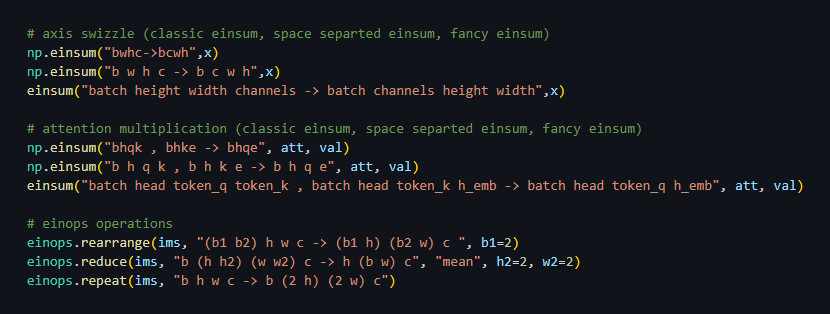
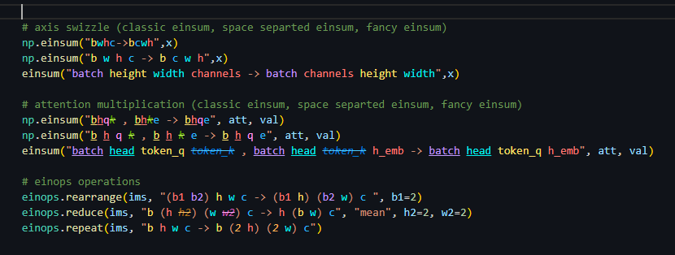
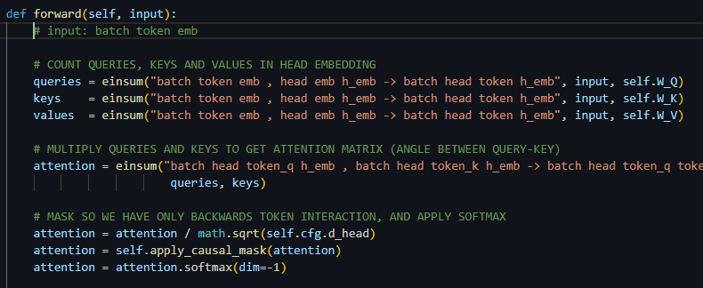
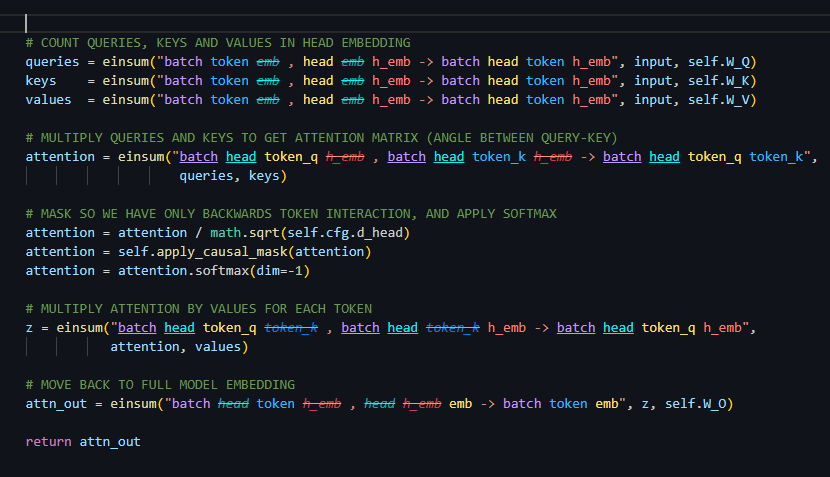

<!---<h1 align="center">Ein Color</h1>--->

  

***
 Ein Color brings term coloring and styling to   your einsum / einops equations for better readability.
***

 

## Description

If you moved to using einsum - that's great for readability. If you're also using [fancy einsum](https://github.com/Kiv/fancy_einsum) and [einops](https://github.com/arogozhnikov/einops) - that's even better. But it still can be hard to visually find the terms across the equations.

Here are a few examples. See how much you can grasp from looking at them: 

And now try the same with Ein Color on:

- Each term in an equation has it's own unique color so you can follow it across all of the arguments and result. 
- Every reduced term is ~~crossed~~ out so it's easier to notice without comparing with the results. 
- When there is more than 1 argument, repeating terms across all of the equation get <ins>underlined</ins>. 

If you find this useful then give Ein Color a try.

*(you can also see a full attention head example at the end of the readme)*

  

## Install

You can install the latest beta version using the .vsix file. In VSCode open the extensions tab a click the top "..." and choose "install from VSIX ...".

 

## Features

- Term coloring and styling for einsum (from numpy, pytorch, tensorflow ...), fancy einsum and einops
- Automatically turn on/off coloring and styling by moving cursor
- Handle classic "no space", space separated and full word einsum/einops equation format
- Use hashing so each term has a unique color across different equations

 

## Known limitations

Currently Ein Color works on a line-by-line basis so it only handles einsum / einops written without line breaks. This seems to cover most of the usage when looking at the GitHub codebase.

This approach was chosen to optimize updating the coloring/styling without having to resort to the typical approach of "update the whole file at even the smallest change".

 

## Extension Default Settings

- ### [ Mode & Cursor Near Range ]
    
    The default **Mode** is set to *"Cursor On Line"* so the extension is on only when cursor is on any line with an equation (or near it). This way you can easily control Ein Color and restricting it to only when it is needed, limiting the color clutter.

    

    **Cursor Near Range** controls how close the cursor has to be to a line with an equation. "0" means it has to be on line. The default is "2" so it can be a two lines above or below. This limits "flickering" when moving the cursor up and down the code between close equations.

    You can also set the **Mode** to *"Always On"* if you like the coloring and it's not cluttering your view when working on other parts of the code.

- ### [ Coloring, Hash Seed & Bold Terms ] 
    When using the *"Hashed"* **Coloring**, Ein Color hashes each term text to get a unique number and pick a color from the color palette. With a finite amount of distinguishable colors (the default palette has 8 colors) it means that there will be some color collision. On the other hand each term will have the same color in any equation.
    
    The default *"Semi Hashed"* *Coloring**, remedies this by first assigning unique colors to non colliding terms, and then fits the rest to the remaining available colors. This in most cases means all but a few terms will have the same colors in any equation.

    Optionally you can change **Hash Seed** for above options to shift the colors to your liking and to possibly have less collisions (best to do this while using *"Hashed"* **Coloring**).  

    The *"Ordered"* **Coloring** picks colors from the palette in the order of the terms appearing in the equation. 

    You can also turn on **Use Bold Term** to have all the terms bold. This can help making the colors more visible.

- ### [ Custom Palette ]
    Ein Color uses a default palette that has both a light and dark theme version .

    But you can use your own palette by supplying a list of valid css colors. The default palettes color values are shown at the end of this readme, so you can change/remove/add any colors or create a new one.

- ### [ Equation Prefix ]
    By default Ein Color will search for any einsum prefix or the three einops functions prefix. If you use shorthands for einops (e.g. *"reduce("* instead of *"einops.reduce("* ) you can change it here. 

- ### [ Included Files ]
    By default python and jupyter notebook files are included so Ein Color will only analyze these files. You can add any additional files or limit the scope to specific folder using [glob](https://code.visualstudio.com/docs/editor/glob-patterns) patterns. 

 

## Attention head example
Here's longer example of a classic attention head. Fancy einsum is used so we have full axis names. You can compare how easier it is to follow what's happening with Ein Color. First the normal version: 

And the same but with Ein Color:

 

## Default palette colors

### Light Theme
    lch(69% 60 30 )
    lch(71% 60 260)
    lch(78% 60 69 )
    lch(70% 60 303)
    lch(93% 80 120)
    lch(78% 60 334)
    lch(85% 60 196)
    lch(90% 60 90 )

### Dark Theme
    lch(40% 90  30 )
    lch(40% 80  260)
    lch(48% 150 69 )
    lch(40% 80  303)
    lch(48% 90  120)
    lch(44% 85  334)
    lch(46% 99  196)
    lch(53% 80  90 )

